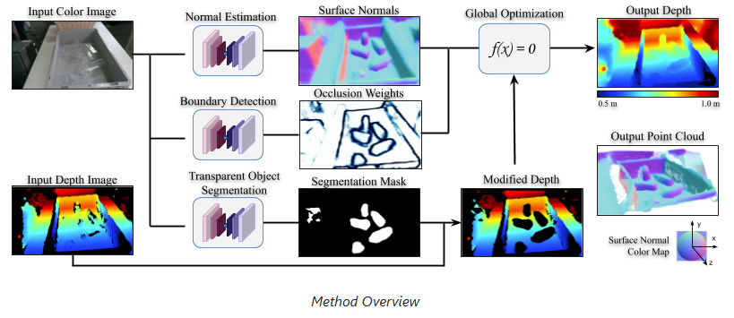

# Note_for_cleargrasp
My note for ClearGrasp model application.

# Introduction
## ClearGrasp
- A deep learning approach for estimating accurate 3D geometry of transparent objects for robotic manipulation.
### Procedure
1. Uses the color image as input to deep convolutional networks to infer a set of information : **surface normals**, **occlusion boundaries**.
2. The mask is used to **clean** the input depth by removing all points corresponding to transparent surfaces.
3. Then, uses a **global optimization algorithm** which uses surface normals and occlusion boundaries to reconstruct the depth of the transparent objects.
### Method Overview

# Ref
- Paper : [ClearGrasp: 3D Shape Estimation of Transparent Objects for Manipulation](https://arxiv.org/abs/1910.02550)
- Github : [Official repository for the ClearGrasp paper](https://github.com/Shreeyak/cleargrasp/tree/master)